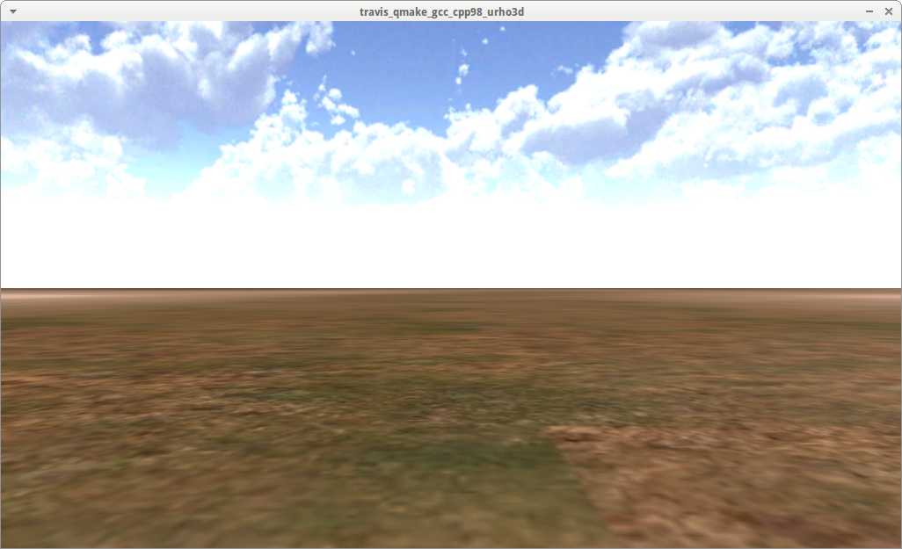

# travis_qmake_gcc_cpp98_urho3d

This GitHub is part of [the Travis C++ Tutorial](https://github.com/richelbilderbeek/travis_cpp_tutorial).

The goal of this project is to have a clean Travis CI build, with specs:
 * Build system: `qmake`
 * C++ compiler: `gcc`
 * C++ version: `C++98`
 * Libraries: `STL` and `Urho3D`
 * Code coverage: none
 * Source: one single file, `main.cpp`

More complex builds:
 * Use of C++11: [travis_qmake_gcc_cpp11_urho3d](https://www.github.com/richelbilderbeek/travis_qmake_gcc_cpp11_urho3d)
 * Use of C++14: [travis_qmake_gcc_cpp14_urho3d](https://www.github.com/richelbilderbeek/travis_qmake_gcc_cpp14_urho3d)

Less builds:
 * Use of STL only: [travis_qmake_gcc_cpp98](https://www.github.com/richelbilderbeek/travis_qmake_gcc_cpp98)

